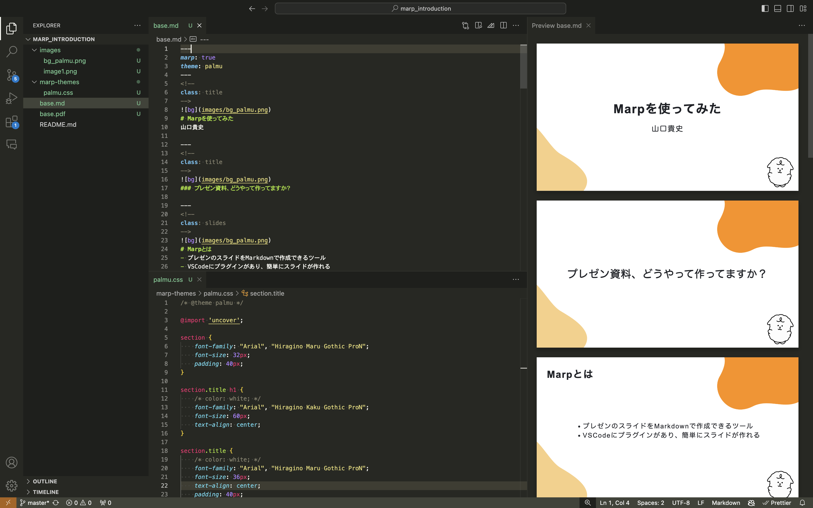

<!--
class: title
-->

# Marpを使ってみた
山口貴史

---
<!--
class: title
-->

### プレゼン資料、どうやって作ってますか？

---
<!--
class: slides
-->

# Marpとは
- プレゼンのスライドをMarkdownで作成できるツール
- VSCodeにプラグインがあり、簡単にスライドが作れる
  
---
<!--
class: slides
-->

# メリット

- 早く作れる
  - VSCodeで箇条書きするだけでスライドになる
  - 既存のMarkdownの文書も再利用しやすい
- 快適に作れる。文書作成に集中できる。
  - プレビューが見やすい
  - デフォルトでテーマが用意されている
- Gitなどでバージョン管理ができる

---
<!--
class: slides
-->

# 始め方

- Marp for VS CodeプラグインをVSCodeにインストール
  - https://marketplace.visualstudio.com/items?itemName=marp-team.marp-vscode
- プレビューでリアルタイムでスライドを確認しながらMarkdownを書いていく

---
<!--
class: title
-->

# 使いかたはこんな感じ

---

---
<!--
class: slides
-->

# 使ってみた感想

- 基本的なMarkdownが使えた！
- 画像を設定できた！
- スクショをリポジトリ下に移動させるのが少し面倒ではあった。
- 反映が軽快で使いやすい！
- 勝手に中央に寄ってくれたりするので位置の微調整とかに時間を使わなくてすむ！
- デフォルトのテーマを利用することもできるし、
- カスタムテーマをCSSで作成することもできる！
- PDFですぐ出力できる！
- 慣れれば早く作れそう！
  
---
<!--
class: slides
-->

# 今後やってみたいこと
- Draw.ioなどの図表とかもVSCodeのプラグインがあるらしいのでそういうのも使ってMarpでプレゼンできる幅を広げていきたい
- 社外にアウトプット
---
<!--
class: title
-->

### みなさんも気軽にLTしてみましょう！

---
<!--
class: title
-->

### ご清聴ありがとうございました

